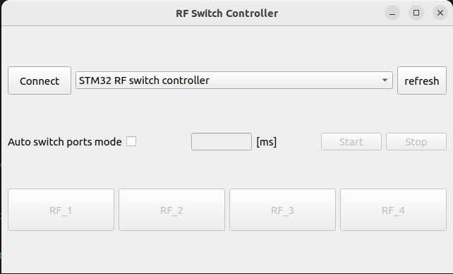
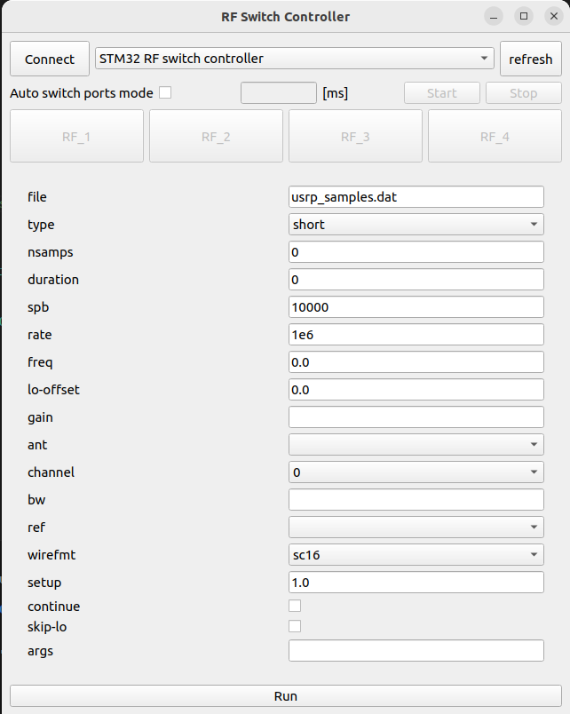
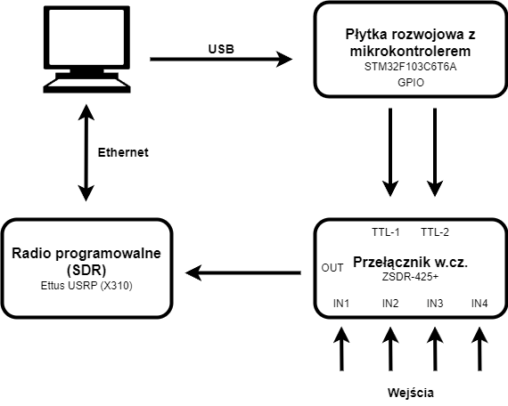

# Układ programowego sterowania przełącznikiem w.cz
Projekt dyplomowy inżynierski


## Budowanie projektu
### GUI wersja I


Aby wykorzystać wersję I GUI należy w pliku /inc/gui.hpp zakomentować definicję RX_SAMPLES_TO_FILE
```cpp
//#define RX_SAMPLES_TO_FILE    //switch GUI mode
#define MIN_WINDOW_HEIGHT 350
#define MIN_WINDOW_WIDTH 640
```
W tym przypadku nie jest wymagany plik src/rx_samples_to_file.cpp

### GUI wersja II


Aby wykorzystać wersję II GUI należy w pliku /inc/gui.hpp odkomentować definicję RX_SAMPLES_TO_FILE
```cpp
#define RX_SAMPLES_TO_FILE    //switch GUI mode
#define MIN_WINDOW_HEIGHT 350
#define MIN_WINDOW_WIDTH 640
```
W tym przypadku jest wymagany plik src/rx_samples_to_file.cpp, który można pobrać z repozytorium UHD [rx_samples_to_file.cpp] jeśli nie został wcześniej umieszczony.

W celu budowania i kompilacji projektu należy wpisać poniższe komendy będąc w folderze projektowym:
```sh
cd build
cmake ..
make
```
Gdy proces przebiegnie pomyślnie, aplikację można uruchomić:
```sh
./RFswitchController
```

### Przykładowe zastosowanie


*w przypadku płytki rozwojowej domyślnie wykorzystywane są piny PA5 oraz PA6


[rx_samples_to_file.cpp]: <https://github.com/EttusResearch/uhd/blob/master/host/examples/rx_samples_to_file.cpp>